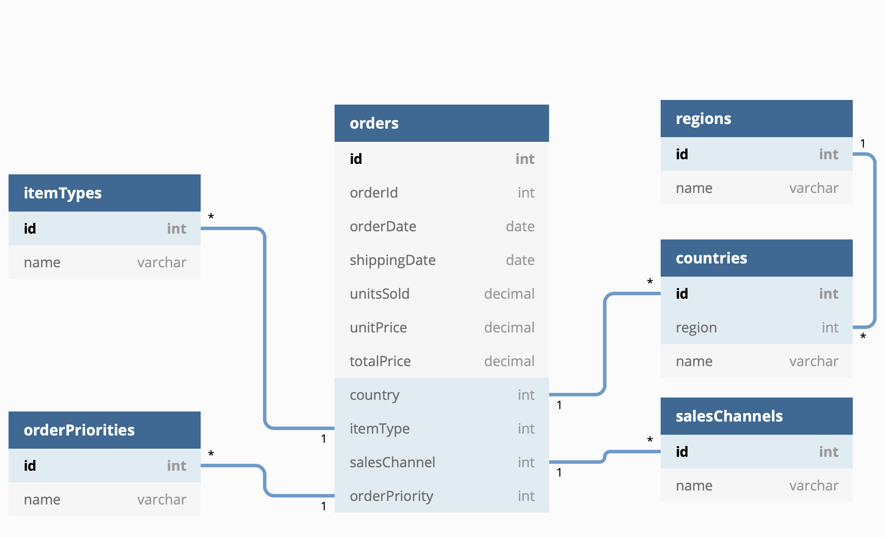

# Webiny performance benchmark

This benchmark is structured around 3 main parts with the goal of building confidence in the levels of scale and traffic Webiny is able to handle. The benchmark is ran on a standard non-VPC deployment with zero changes made to the default setup. You can easily deploy an identical configuration by following our [get started tutorial](<[http://docs.webiny.com/docs/tutorials/install-webiny/](http://docs.webiny.com/docs/tutorials/install-webiny/)>) and replicate [our results](https://docs.webiny.com/docs/webiny-overview/performance-benchmark/introduction).

With this benchmark we are not comparing our system to other systems on the market, but we are giving our users a clear overview of Webiny's capabilities and the underlying serverless infrastructure that's included with the default setup.

Also, the goal of this test is not to fund bugs, but to demonstrate Webiny's speed, scalability and stability.

**In case you wish to replicate this test, a notice regarding cost:**
For a new AWS user all of the AWS services are included as part of the free tier, however, due to the scale of this benchmark, as we're inserting and then reading more than 1M records, some of the services will go over the AWS free tier limits.

Finally to mention, this is the **default setup** we're testing here. In case additional scale and performance is needed, that can be achieved by simply adjusting the infrastructure configuration templates and upgrading some of the resources to a higher memory or CPU options.

### Benchmark 1: Page Builder - page delivery

The first benchmark focuses on the performance of the Webiny Page Builder app. In particular, how fast it can deliver a page to an end user.

The page that's used for the test is the default homepage that gets shipped with every Page Builder installation. So it's not your sample hello world page, but it's actual representation of a page you might use in production. In the test we're downloading only the HTML of the page, but not the linked assets like images, JS, and CSS.

### To replicate this test:

1. Have a Webiny instance running
2. Clone this repo
3. Have JMeter installed
5. Have [JMeter Plugins Manager](https://jmeter-plugins.org/install/Install/) installed, or manually install the required plugins
5. Amend the `benchmarks/pb-page-delivery.jmx` and set the `WEBINY_WEBSITE_URL` user variable to match your Public website: Website URL value
6. Create a CloudWatch dashboard using the `cloudwatch-dashboard.json` file in this repo and update the resources to point to those used by your Webiny instance
   **Note**: don't add the protocol, just the domain name, example: "xxxxxxx.cloudfront.net"
6. Run the test `HEAP="-Xms512m -Xmx4096m" ./_PATH_TO_JMETER_/bin/jmeter.sh -n -t ./pb-page-delivery.jmx -l ./results.log -e -o ./report`

We recommend running the test from within the same AWS region using a more powerful instance, like `c5.2xlarge` as depending on your hardware you might not be able to generate the required load for the test.

### Benchmark 2: Headless CMS - Inserting 1 million records using the Manage API

This is the data structure we'll be working with:

For this benchmark we wanted a fairly representative example that has several references, as those are usually the bottlenecks in many systems. In our case, we have a main entity called `orders` and 4 direct references: `itemTypes`, `orderPriorities`, `countries` and `salesChannels`. We also have a 3rd level of hierarchy between the `countries` entity and `regions` entity.

### Prepare the content models

For this test you need to first prepare the content model structure. To do that:

1. Have a Webiny instance running and make sure you have an API token generated with full permissions on the Headless CMS module.
2. Clone this repo: [https://github.com/webiny/webiny-examples](https://github.com/webiny/webiny-examples)
3. Inside the `webiny-examples` repo navigate to `headlesscms-import-export`
4. Amend the `config.js` file. You only need the `import` section
5. From the `benchmark` repo, copy the contents of `test-data-set/content-models-and-groups.json` into the `./tmp/export.json` inside the `headlesscms-import-export`
6. Run `node index.js` inside the `headlesscms-import-export` and choose the import command

This will create the required content model groups and content models inside your Webiny instance.

### Prepare the data

Before you can run the benchmark you need to populate the references, basically all content models except the `Order` content model. The prepare process will also generate a test data set that you will need for your benchmark.

To do this:

1. Clone this repo.
2. Modify `config.js` file
3. Run `yarn`
4. Run `yarn prepare`

Note: In case you need to run `yarn prepare` multiple times, make sure you empty all the generated files from the `./tmp` folder.

### Run the test

1. Amend the `benchmarks/hc-write-data.jmx` and populate the user variables
2. Run the test `HEAP="-Xms512m -Xmx4096m" ./_PATH_TO_JMETER_/bin/jmeter.sh -n -t ./hc-write-data.jmx -l ./results.log -e -o ./report`

### Benchmark 3: Headless CMS - Different read operations that are performed on 1 million records using the Read API

If you've done the previous test, to run this one:

1. Amend the `benchmarks/hc-read-data.jmx` and populate the user variables
2. Run the test `HEAP="-Xms512m -Xmx4096m" ./_PATH_TO_JMETER_/bin/jmeter.sh -n -t ./hc-read-data.jmx -l ./results.log -e -o ./report`

## Results

All the JMeter logs and generated HTML reports from our own tests can be found inside the `benchmarks/results` folder.
